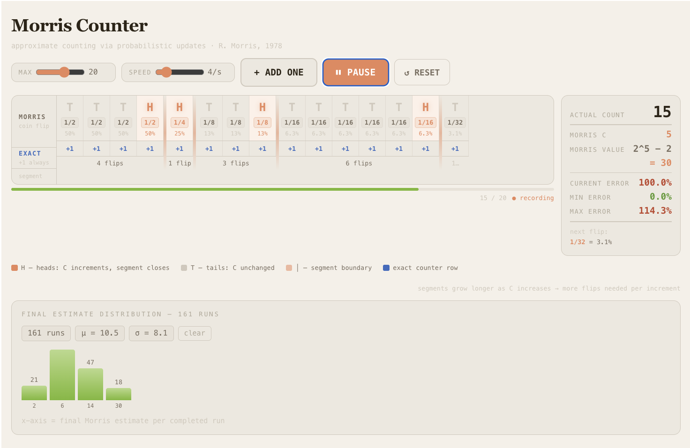

# Morris Counter Visualization

An interactive classroom visualization of the Morris approximate counting algorithm (R. Morris, 1978), built in React. Designed for teaching probabilistic data structures in an algorithms or data structures course.



---

## What Is the Morris Counter?

The Morris counter solves a deceptively simple problem: **how do you count a very large number of events using as little memory as possible?**

An exact counter storing *n* requires ⌈log₂(n)⌉ bits. Morris's insight was that you don't need to know *n* exactly — you only need a good estimate. By storing a value *C* and incrementing it with decreasing probability, you can estimate counts up to billions while using only log₂(log₂(n)) bits. The estimate is recovered as 2^C − 2.

The catch: Every increment is a coin flip. With counter value *C*, you flip a biased coin that comes up heads with probability 1/2^C. Only on heads does *C* increment. The higher *C* climbs, the rarer those heads become — which is exactly what keeps the counter small.

It was analyzed and popularized by Philippe Flajolet, which you can read more about in the paper ["The Story of HyperLogLog: How Flajolet Processed Streams with Coin Flips"](https://arxiv.org/abs/1805.00612).

---

## What This Visualization Shows

The core display is a **growing tape** of coin flips, read left to right, one column per item counted.

```
Morris │ T    T    T    H  │ T    T    T    T    T    T    H  │ T  …
       │ 1/2  1/2  1/2  1/2│ 1/4  1/4  1/4  1/4  1/4  1/4  1/4│ 1/8
       │ 50%  50%  50%  50%│ 25%  25%  25%  25%  25%  25%  25%│ 12%
       │         3 flips   │              7 flips              │
──────────────────────────────────────────────────────────────────────
Exact  │ +1   +1   +1   +1 │ +1   +1   +1   +1   +1   +1   +1 │ +1
```

Each column shows the flip result (H or T), the probability it was drawn at, and its percentage. A coral vertical bar closes each **segment** — the stretch of flips between two heads events. The segment flip count appears below.

**The key thing students see:** segments get longer as you move right. It took 3 flips to get the first heads (at 1/2 probability). It took 7 to get the second (at 1/4). The counter is becoming harder and harder to increment — and that's the whole trick.

The **exact counter row** below never changes. `+1 +1 +1 +1 +1` forever. The contrast between the two rows is the compression made visible.

---

## Features

**Step-by-step mode** — Press `+ ADD ONE` to count one item at a time. Each column appears complete and final: result, probability fraction, and percentage all visible immediately, with no animation delay. Designed for instructor-paced narration.

**Play mode** — Press `▶ PLAY` to run automatically at 1–20 flips per second (adjustable). Useful for demonstrating multiple runs and filling the histogram. Pauses with `⏸ PAUSE`.

**Auto-reset** — When the actual count reaches MAX (adjustable from 5 to 30), the run is automatically recorded to the histogram and the tape resets. Play mode continues uninterrupted into the next run.

**Live stats panel** — Always visible to the right of the tape:
- Actual count
- Morris C and the estimate formula (2^C − 2 = …)
- Current, minimum, and maximum error percentage for this run, color-coded green / amber / red
- Next flip probability

**Persistent histogram** — Final Morris estimates from completed runs accumulate in a bar chart showing the distribution across sessions. Mean (μ) and standard deviation (σ) update live. Storage persists across page reloads via `window.storage`.

---

## Getting Started

This is a single React component. Drop `morris-counter.jsx` into any React project.

```bash
# If starting fresh with Vite
npm create vite@latest morris-counter -- --template react
cd morris-counter
cp path/to/morris-counter.jsx src/App.jsx
npm install
npm run dev
```

Or render it directly in a Claude artifact — it requires no dependencies beyond React itself.

The component uses `window.storage` for histogram persistence (available in Claude's artifact environment). In a standard browser, replace the three `window.storage` calls with `localStorage` equivalents:

```js
// get
const raw = localStorage.getItem(STORAGE_KEY);
if (raw) setRuns(JSON.parse(raw));

// set
localStorage.setItem(STORAGE_KEY, JSON.stringify(newRuns));

// delete
localStorage.removeItem(STORAGE_KEY);
```

---

## Files

```
morris-counter.jsx        The visualization component
morris-counter-spec.md    Full specification (palette, layout, algorithms, pedagogy)
README.md                 This file
```

---

## Classroom Use

**Recommended sequence:**

1. Start with the tape empty. Ask students: "How would you count a billion events on a device with 20 bytes of RAM?"
2. Press ADD ONE five or six times slowly, narrating each coin flip and its probability.
3. Point to the first segment closure (the first H). Ask: "How many flips did it take? Why is that?"
4. Continue until C reaches 3 or 4. Point to the stretching segments. Ask: "What's happening to the segment lengths?"
5. Switch to PLAY at speed 4–6/s and run to MAX. Look at the error readout.
6. Reset and run 8–10 more times. Let the histogram fill. Discuss the variance: sometimes the estimate is close, sometimes not. That's the algorithm's inherent trade-off.

**Key questions to ask at each segment boundary:**
- What was the probability of getting that heads?
- How many bits does C take to store right now?
- How does 2^C − 2 compare to the actual count?

---

## Algorithm Reference

```
Initialize:  C = 1

ADD ONE:
  flip a coin with P(heads) = 1 / 2^C
  if heads:  C = C + 1

Estimate:  n̂ = 2^C − 2
```

The expected value of 2^C − 2 equals the actual count *n*. The relative error is approximately 1/√2 ≈ 0.707, meaning typical estimates are within ~70% of the true value. Multiple independent Morris counters can be averaged to reduce variance.

---

## Design Notes

The visualization was designed around a single pedagogical constraint: **the tape is the whole story.** Every other element — the stats panel, the progress bar, the histogram — is a readout of what the tape already shows. Nothing is hidden or deferred.

Specific decisions that reflect this:

- **No animations.** Columns appear complete. The instructor controls the pace, not the interface.
- **Probability on every column.** Students can read the denominator doubling as they scan right. The abstraction and the concrete evidence live in the same place.
- **The exact counter row never changes.** Its monotone `+1` march is the visual anchor that makes the Morris row's sparseness legible.
- **Segments are labeled.** The flip count below each segment (`"7 flips"`) gives students a number to hold onto when discussing why the counter is efficient.

See `morris-counter-spec.md` for a complete technical specification including every color token, pixel measurement, and component behavior.

---

## License

MIT. Use freely in courses, adapt for your own algorithms visualizations.

---

*Built with Claude Sonnet 4.5 and Sonnet 4.6. Designed for classroom projection on a light background.*
